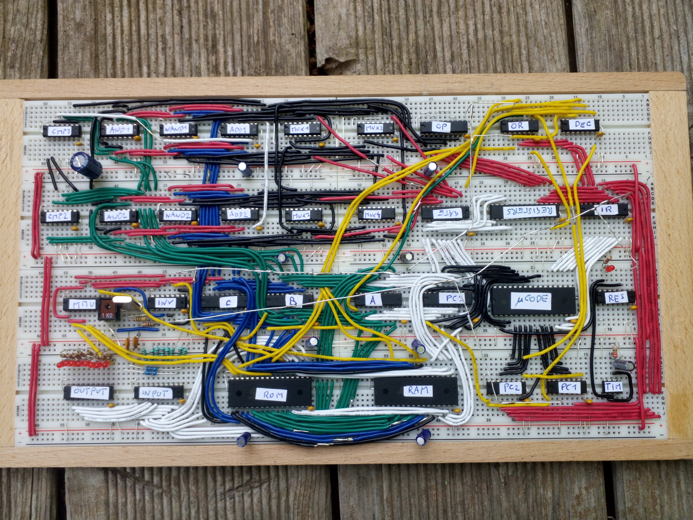
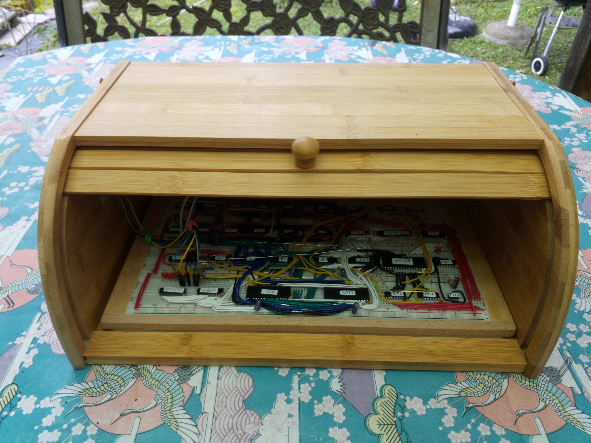

# BreadBin computer
A CPU made of 7400 logic on breadboards - inside a bread bin ;-) 

## Current design 

After various experiments and failed attempts to design a 7400-based computer, I came to a quite minimalistic
8-bit approach which is nevertheless pretty versatile and can utilize a surprisingly large amount of memory
resources. The CPU core itself executes its program from a static 64K flash memory and can access 32 bytes of
internal RAM (which can be considered registers for all practical purposes). Access to the external memory 
area (up to 16MB of address space) allows addition of RAM, ROM and memory mapped IO. In the current setup this
directly mirrors the capabilities of my [OS816 reference design](https://github.com/c0pperdragon/OS816).

## Computer case

With the CPU already built so nicely on an actual wooden board, I had the idea to put it together with
the rest of the computer into a matching bread bin. Because the machine will not require any ventilation this
will keep the dust out quite reliably.

 
## On bread boards

Since a very long time I wanted to design my own CPU and build it from smaller parts, preferable 
on bread boards. My main problem with the approach were my bad experiences with bread boards as a whole,
as they seemed to be too unreliable for anything more serious than arduino tinkering.
As it turns out it is only a matter of using high-quality boards and cabling to get a reliably working
build. The boards I now use (BB830 from BusBoard) are quite expensive, but worth every penny 
and give me very little trouble.

In previous attempts I had much trouble to get a stable ground reference accross all the individual boards.
So this time I directly soldered together ground rails of parallel boards with silver wire on the bottom
and then placed the boards on top of a large plane of aluminium foil. This foil should make good contact to all
the silver ground wires to connect them together and additionally work as shielding. 
So far this works pretty good.

When using this kind of setup it is important to also use a matching logic family of chips. 74AC, 74ACT, 74LVC or 
others have a very fast switching characteristics. This is great for many applications but in a large build with
long and unshielded cables, their brutally steep signal edges wreck havoc with signal integritiy.
So I settled for the moderately fast and well-behaved 74HC logic ICs with only a few 74AC parts to speed up the ALU.

## Software

One of the hardest parts of home-made computers is to actually build all the software to make the machine useful.
To get the benefit of existing software, the breadboard computer core is designed to emulate the existing CPU
65C816. Together with 512K RAM and 512K Flash and identical IO capabilities, this now is a completely software 
compatible replica of the OS816 system - running at a lower overall speed, of course.

To properly stay in the "bread" theme, the emulator is called [Bernd](bernd) or BER/ND (if you like a 
more technical appearance). People familiar with the german TV station "Kinderkanal" will recognize the reference.

