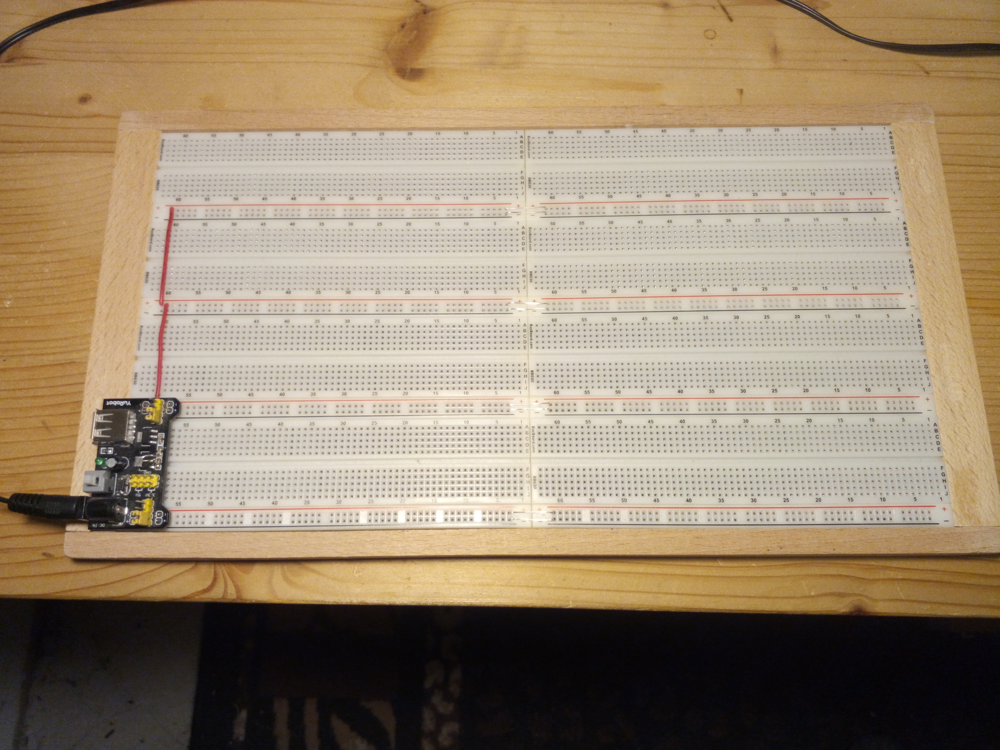
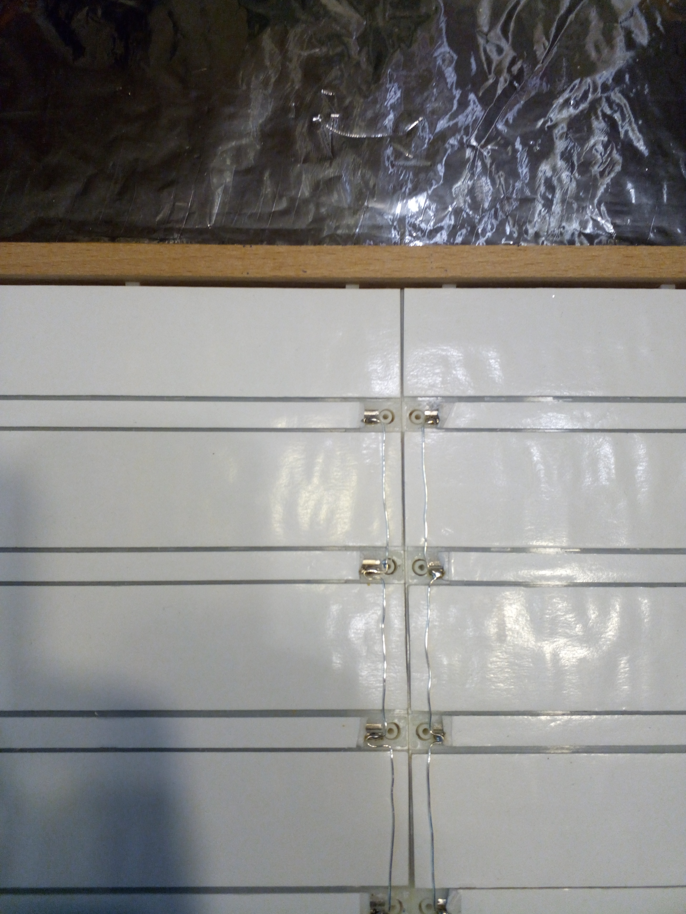

# BreadBin computer
A CPU made of 7400 logic on breadboards - inside a bread bin ;-) 

## On bread boards

Since a very long time I wanted to design my own CPU and build it from smaller parts, preferable 
on bread boards. My main problem with the approach were my bad experiences with bread boards as a whole,
as they seemed to be too unreliable for anything more serious than arduino tinkering.
As it turns out it is only a matter of using high-quality boards and cabling to get a reliably working
build. The boards I now use (BB830 from BusBoard) are quite expensive, but worth every penny 
give me very little trouble.

## Proper ground plane

In previous attempts I had much trouble to get a stable ground reference accross all the individual boards.
So this time I directly soldered together ground rails of parallel boards with silver wire on the bottom
and then placed the boards on top of a large plane of aluminium foil. This foil should make good contact to all
the silver ground wires to connect them together and additionally work as shielding. 
So far this works pretty good. 

## Which 7400 logic?

When using this kind of setup it is important to also use a matching logic family of chips. 74AC, 74ACT, 74LVC or 
others have a very fast switching characteristics. This is great for many applications but in a large build with
long and unshielded cables, their brutally steep signal edges wreck havoc with signal integritiy.
So I settled for the moderately fast and well-behaved 74HC logic ICs.

## Software

One of the hardest parts of home-made computers is to actually build all the software to make the machine useful.
To get the benefit of existing software the bread board computer core is intended to emulate an existing CPU
(specifically the 65C816). This emulated CPU can then interface to some additional RAM and ROM and other
parts to become a full computer to execute code that was originally written for my OS816 system.

## Computer case

With the CPU already built so nicely on an actual wodden board, I had the idea to put it together with
the rest of the computer into a matching bread bin. Because the machine will not require any ventilation this
will keep the dust out quite reliably.

 
