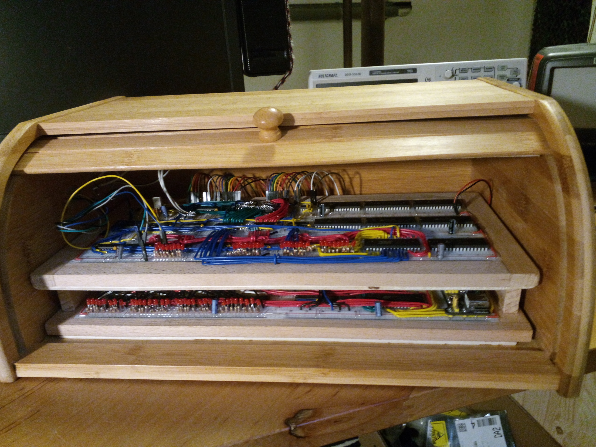
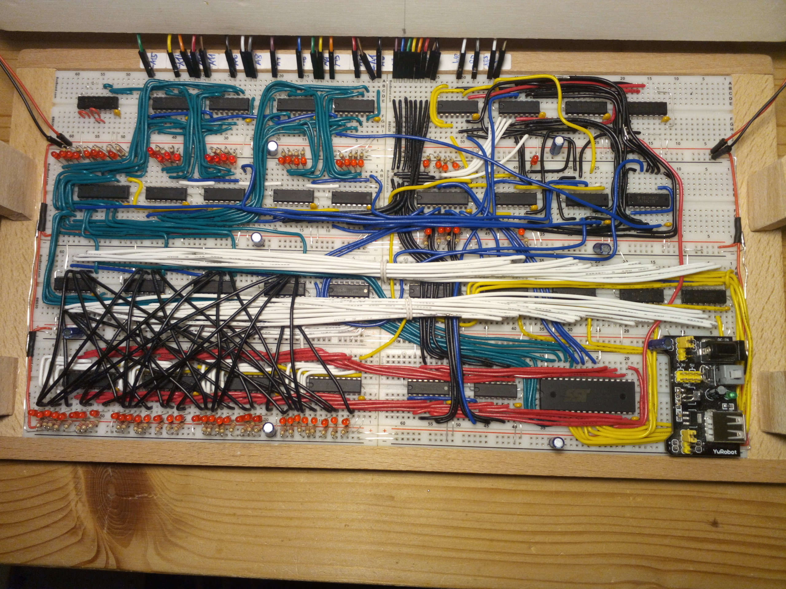
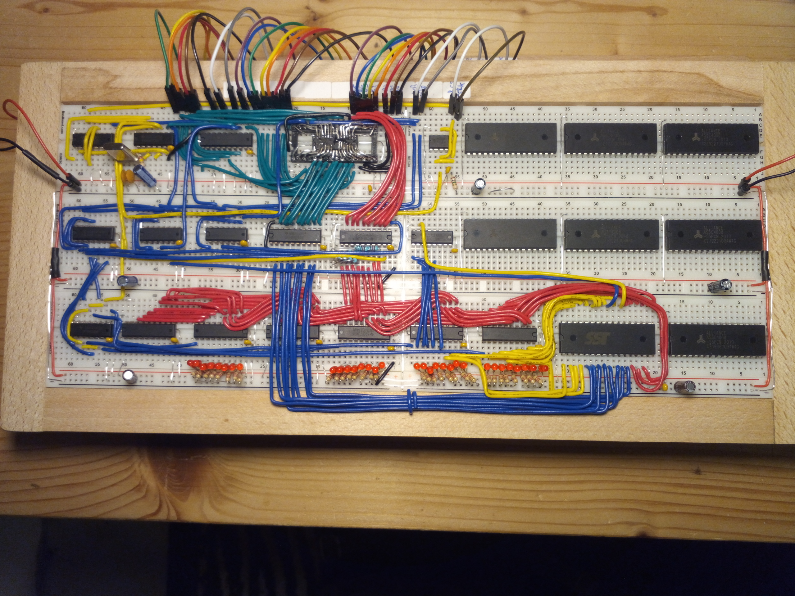
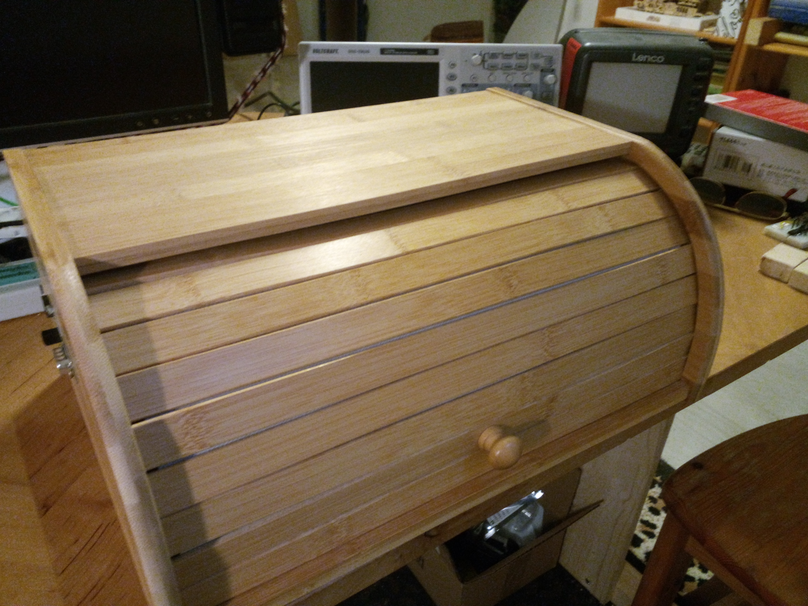
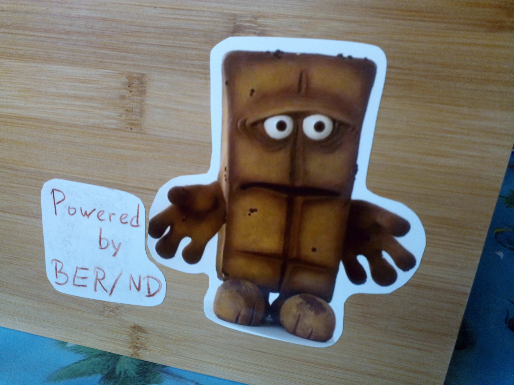

# BreadBin
A CPU made of 7400 logic on breadboards - inside a bread bin ;-) 

## On bread boards

Since a very long time I wanted to design my own CPU and build it from smaller parts, preferable 
on bread boards. My main problem with the approach were my bad experiences with bread boards as a whole,
as they seemed to be too unreliable for anything more serious than arduino tinkering.
As it turns out it is only a matter of using high-quality boards and cabling to get a reliably working
build. The boards I now use (BB830 from BusBoard) are quite expensive, but worth every penny and never 
gave me any trouble.

## Which 7400 logic?

When using this kind of setup it is important to also use a matching logic family of chips. 74AC, 74ACT, 74LVC or 
others have a very fast switching characteristics. This is great for many applications but in a large build with
long and unshielded cables, their brutally steep signal edges wreck havoc with signal integritiy.
So I settled for the moderately fast and well-behaved 74HC logic ICs together with only a very view 74AC parts to speed
up some critical paths.

## Speed

To make this project uniquely my own and not merely a copy of one of the existing other projects out there,
I wanted to create the fastest possible bread board machine I can. If it is necessary to completely disassemble
the control logic and to modify the whole instruction set to save just 10 ns, I will do it (did yesterday).
Also I will use any possible trick I can ever think of without compromising the spirit of the challenge.
By now the system can run at about 11 MHz, but I step it down to 10MHz to improve reliability.

## Memory and IO

The completed machine contains two 8-bit wide input and output ports which are entirely CPU driven. Currently
only a few bits are in use to implement a simple UART communication link to a text terminal and there is now
much space for future expansions. I already inserted 3.5MB of static RAM next to the 512K of flash,
but did not yet wire it up. I will do this step by step when I actually find a use for it.

## Computer case

With the CPU already built so nicely on an actual wodden board, I had the idea to put it together with
the rest of the computer into a matching bread bin. Because the machine will not require any ventilation this
will keep the dust out quite reliably.

## Software

Building the hardware is only a first step. To actually do something with it, it needs some program to run.
The first step is a simple system monitor by which the user can inspect and change the memory and launch
uploaded programs. In this case it is the "Basic Execution Runtime / Non-Distributed".

